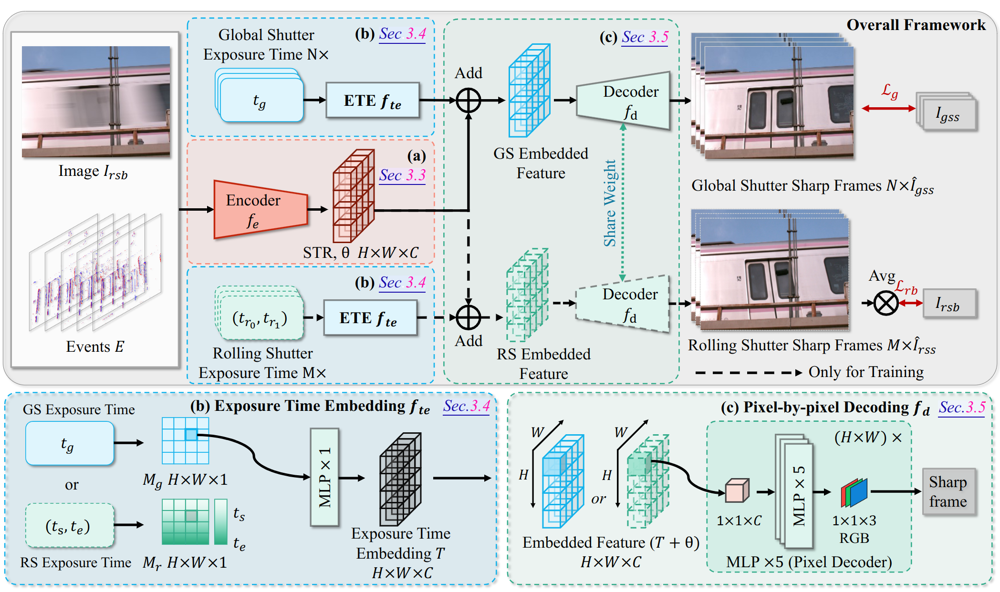

<h1 align="center"> <a href="https://arxiv.org/abs/2305.15078">UniINR: Event-guided Unified Rolling Shutter Correction, Deblurring, and Interpolation</a></h1>
<h5 align="center"> If you like our project, please give us a star ⭐ on GitHub for the latest update. For any questions, contact me via Issue or email (email preferred).</h5>
<h5 align="center"><i> ylu066 at connect.hkust-gz.edu.cn </i></h5>
    
UniINR is an advanced neural framework designed to handle rolling shutter correction, deblurring, and interpolation in a unified approach guided by event-based inputs. This repository provides the code, datasets, and pre-trained models for reproducing results from our ECCV 2024 paper.

## Overview

Our framework, UniINR, is aimed at enhancing video quality by addressing key challenges that arise in event-guided imaging, such as rolling shutter distortion, motion blur, and interpolation between frames. This repository includes all essential tools to train, test, and extend our approach.



- **Video Demo:** [YouTube Link](https://www.youtube.com/watch?v=Zfx9jBkSZmg)
- **Paper:** [Arxiv PDF](https://arxiv.org/pdf/2305.15078)

## Pre-trained Models and Logs

For quicker experiments, we provide pre-trained models along with their visualization results and log files. Access them through the provided download links, which should assist in replication and further experiments. Release Link: [OneDrive](https://hkustgz-my.sharepoint.com/:f:/g/personal/ylu066_connect_hkust-gz_edu_cn/EjTW8WAmm1lMuUfboSyD-NMBxhc0zPyzxZK453JK7JmuoA?e=rsh6Cs)

## Dataset

Our work is built on two primary datasets used for training and testing:
1. **DeepUnrollNet Dataset** ([GitHub Link](https://github.com/ethliup/DeepUnrollNet))
2. **EvUnroll Dataset** ([GitHub Link](https://github.com/zxyemo/EvUnroll))

Additionally, our training incorporates:
- **GEV Dataset:** Available for download on [Baidu](https://pan.baidu.com/s/1_tZxJBeLaznrI0UomsPh9A?pwd=evun#list/path=%2F)
- **Fastec Dataset:** Fastec is segmented for training and testing:
    - [Fastec Training Data](https://drive.google.com/open?id=1gJoI7PSv7KEm2qb9-bt6hiyZ3PPlwEpd)
    - [Fastec Test Data](https://drive.google.com/open?id=1Yfu6sOgIa6vJ6VwAedycjLu-_7rx7vZ2)

### Simulating New Data
For generating new rolling shutter and blurred datasets, use the following scripts:

1. **Rolling Shutter Blurred Frames:**
   ```bash
   tools/1-rs-blur-dataset-generation/generate_rs_blur_frames_fastec.sh
   ```
2. **Rolling Shutter Sharp Frames:**
   ```bash
   tools/1-rs-blur-dataset-generation/generate_rs_sharp_frames_fastec.sh
   ```

Or, customize dataset generation with:
```bash
python tools/1-rs-blur-dataset-generation/generate_rs_blur_frames.py \
    --dataset_path="./dataset/2-Fastec-Simulated/Train/" \
    --blur_accumulate_frames=<level of blur> \
    --blur_accumulate_step=<rolling step size> \
    --dataset="Fastec"
```

## Training

To begin training, use the following command structure:
```bash
python egrsdb/main.py \
  --yaml_file=<YAML_FILE> \
  --log_dir=<LOG_DIR> \
  --alsologtostderr=True
```
Ensure that the specified `YAML_FILE` contains the correct configuration for your experiment setup.


## Citation

If you find UniINR helpful in your research, please consider citing our paper:
```bibtex
@inproceedings{yunfanuniinr,
    title = {UniINR: Event-guided Unified Rolling Shutter Correction, Deblurring, and Interpolation},
    author = {Yunfan, LU and Liang, Guoqiang and Wang, Yusheng and Wang, Lin and Xiong, Hui},
    booktitle = {European Conference on Computer Vision (ECCV)},
    year = {2024},
}
```

## Acknowledgements

We would like to thank the authors of the following works for making their datasets available, which greatly facilitated our research:

- **DeepUnrollNet** ([GitHub Link](https://github.com/ethliup/DeepUnrollNet))
- **EvUnroll** ([GitHub Link](https://github.com/zxyemo/EvUnroll))
